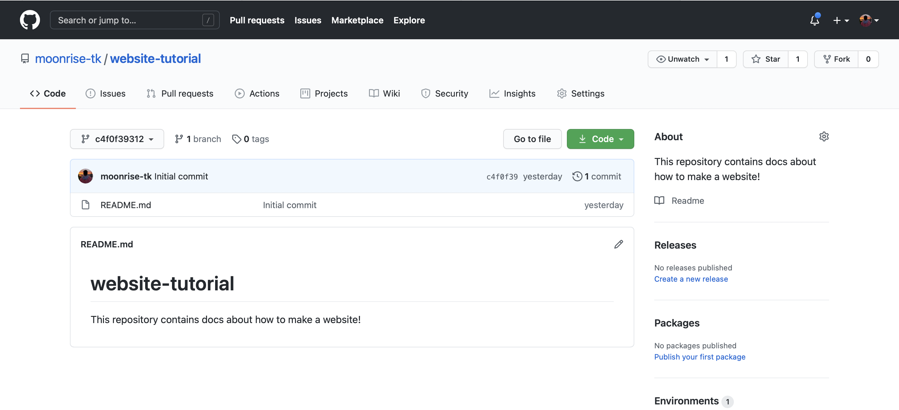

This repository contains docs about how to make a minimal website!

We'll be making a website using [Github Pages](https://pages.github.com) and [11ty](https://www.11ty.dev). You will __not__ need to know how to program, to use this guide. However, if you do know HTML/CSS, you'll be able to use it to make your website a little more spiffy.

## Introduction

*What are we gonna do?*

When you request a website on your browser, that request goes to a server (a kind of computer). The server then returns ("serves") the website to the browser in the form of HTML and CSS. The browser then renders this message into a website. 

This means to make a website, you need to have two things: a **hosting provider**, and the **HTML/CSS** of the website.

### Hosting provider

A hosting provider sets up a server to host your website for you. For this project, we'll be using Github Pages as the provider (since its free and easy). It's free because 1. It's very cheap for Github to set this up and 2. Github gets a marginal amount of advertisement by automatically putting "github" in your URL domain. If you want to use your own domain, you can read about that [here](https://docs.github.com/en/github/working-with-github-pages/configuring-a-custom-domain-for-your-github-pages-site).

### HTML/CSS

As for the HTML/CSS, I'm going to stay true to my promise; you won't need to know how to program in those languages (although if you're interested, [this is a great tutorial](https://html-css-js.com/html/tutorial/). Instead we're going to write the content of our website in something called [**Markdown**](https://www.markdowntutorial.com). Then, we use [11ty](https://www.11ty.dev) to convert those Markdown files into the final HTML/CSS files.

## Setting up Github

*What's Github, and how will we use it?*

Github is basically like a Google Drive, OneDrive, or Dropbox, but for code. People all over the world use it for their programs and code. Then they can share these with other people or make it public to the world. A single project/website will be hosted in something called a **repository**. This entire website was made using this tutorial, by the way! The repository for this website is [here](https://github.com/moonrise-tk/website-tutorial). 

To set up your Github, sign up for an account [here](https://github.com), and [create your first repository](https://docs.github.com/en/github/getting-started-with-github/create-a-repo). Just follow the first part in the second tutorial; no need to commit your first change just yet. Feel free to name your repository whatever you want, but note that the url for your website (if you don't use your own domain) will be `https://your-username.github.io/your-repository-name`.

Once that's created, your repository should look something like this (if you're lost, click on your avatar to navigate to your repositories):

Great! Now we need to clone this repo to our computer and install 11ty.

## Cloning the repo

*What do we do with this repository?*

I said before that Github is like Google Drive. Continuing the analogy, "cloning" the repo is akin to downloading a file from Drive. We're going to clone the repo to our computer, create our website, "push" those changes back to Github, and then activate Github Pages. Just for the record, we could have also created the repo on our computer first rather than on Github first.

I should mention that this part might feel sketchy if you don't have experience with the terminal/command line. If you don't want to mess with it, you can instead install the [Github desktop client](https://desktop.github.com) and follow the steps on there to clone your repo. I encourage you to stick with me through the Terminal though.

Ok so what we're gonna do is open up the Terminal. I believe it's called Command Line on Windows. Once you open it up, it should look something like this:

Don't worry if the colors or other visual elements don't match; in general it should look like a mostly blank window with a cursor. The Terminal is basically a place to ask your computer to do stuff. We're gonna use it to clone the repo. First we want to make sure we navigate the Terminal to the folder we want to clone the repo into. If you type `pwd` and press enter, you can see where its located currently. If you type `ls` and press enter, the terminal will list out the folders you can go into:

Great! Now let's navigate to where we want the repo to be located. For me, that's in `Documents/Projects`. This is done using the `cd` command followed by the folder you want to go into. 

Now to clone the repo, go back to your Github repo. Click on the green "Code" button and then click on the clipboard icon to copy the URL.

 

Then go back to Terminal and type `git clone *your-github-repo-url*` so your computer starts downloading the Github repo:

You should have the repository now installed! If you check on your computer's file browser, you should see a folder with your repository's name wherever your terminal was when you installed it. Opening it should have the file `README.md`. The `md` extension here stands for Markdown.

## Installing 11ty

*The repo's on my computer. How do I turn it into a website?*

